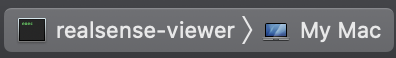

# augr
Artificial Ubiquitous Gathering Relay

## Table of Contents
- [Getting Started](#getting-started)
    - [Activating the Environment](#activating-the-environment)
    <!-- - [Windows Setup](#windows-setup)
    - [Mac Setup](#mac-setup)
    - [Linux Setup](#linux-setup) -->
- [Overview](#overview)
## Getting Started

### Activating the Environment
While in the directory, run the following to 
```
conda env create -f environment.yml
conda activate augr
```

### Launching the Program
Executing the following will open a live feed from the webcam on your device to show the detection and tracking features of AUGR.
```
python main.py
```

<!-- ### Windows Setup

TO DO by a windows NERD

### Mac Setup

After installing the [conda requirements](#activating-the-environment), there is still work to do before you can actually run the code.

#### Intel RealSense SDK

Follow [these](https://dev.intelrealsense.com/docs/macos-installation-for-intel-realsense-sdk) instructions to download the Intel RealSense SDK.

Same as step 6 in the above instructions, but after downloading and making the files, open up the project you made in XCode and build it: there will be a ► (play) button in the top left corner; click it and let the process finish.

#### Verifying the SDK with the RealSense Viewer (Optional)

In XCode, to the right of the build button, there should be a rectangular dropdown menu that displays something along the lines of `ALL_BUILD > My Mac`, as is displayed below:


Click on that dropdown and change it to `realsense-viewer > My Mac`, so it now looks like this:



In the Product Menu, click `Run`, as shown below:


It should automatically open the viewer, which, if the camera is connected, should allow you to see what the camera sees.

### Linux Setup

TO DO by a linux NERD -->

## Overview

Overview of the code base and pipeline.

### Tracking

DeepSORT by default requires detections of the format:

```<frame>, <id>, <bb_left>, <bb_top>, <bb_width>, <bb_height>, <conf>, <x>, <y>, <z>```


Current Capability Workflow:

1- RaspiCam takes pictures at regular interval.

2- Each shot is sent through object detector, which spits out a list of detections for that frame.

3- For each detection in a single list of detections, location is estimated based on distance from camera, orientation of Vision Module, and GPS coords of Vision Module. So for each detection in each frame, we have a 2d vector of the form
(CLASS_OF_OBJECT_DETECTED, (LATITUDE, LONGITUDE)).

4- Each 2d vector is plotted with a python library called Folium. 

## Repo Tour

### Main
Main python file is called main_scope.py under main directory. This file still requires quite a bit of cleanup/modularization but here are the important parts:

-The compiled vision model graph file is called ssdMobileNetGraph. This is in turn points to the actual caffemodel itself. But in main_scope.py, we only care about the graph file. This file is instantiated in main().

-All localization stuff is contained in this file (the lowest hanging fruit in terms of necessary cleanup). The first 4 functions are all localization-related.

-As mentioned above, each frame is sent through this whole gauntlet of processing. The source of this frame extraction is in main() -> "for frame in camera.capture_continuous(...)". Track generation will require an overhaul of this section.

### Detection

all models and model construction stuff goes here

convert model

Vision models are contained here. This project currently uses a MobileNet SSD model using the Caffe framework. I originally made this choice because MobileNet Caffe is compatible with the Intel NCS, the vision processing hardware we are currently using. The python files are there for debugging.

### Image Collection

I imagine a scenario where we'd want to collect images downrange. We didn't put that much effort obviously but could become important.

### Localization

Contains distance estimation and experimental implementations from papers that basically do info-constrained SLAM. Not a lot of immediately useful stuff in here other than distanceFromCamera.py.

### Mapping

Here is where we attempted publishing to ATAK. We settled for plotting on a Folium map last year. This will require a significant time investment.

Publishing and Mapping combine

